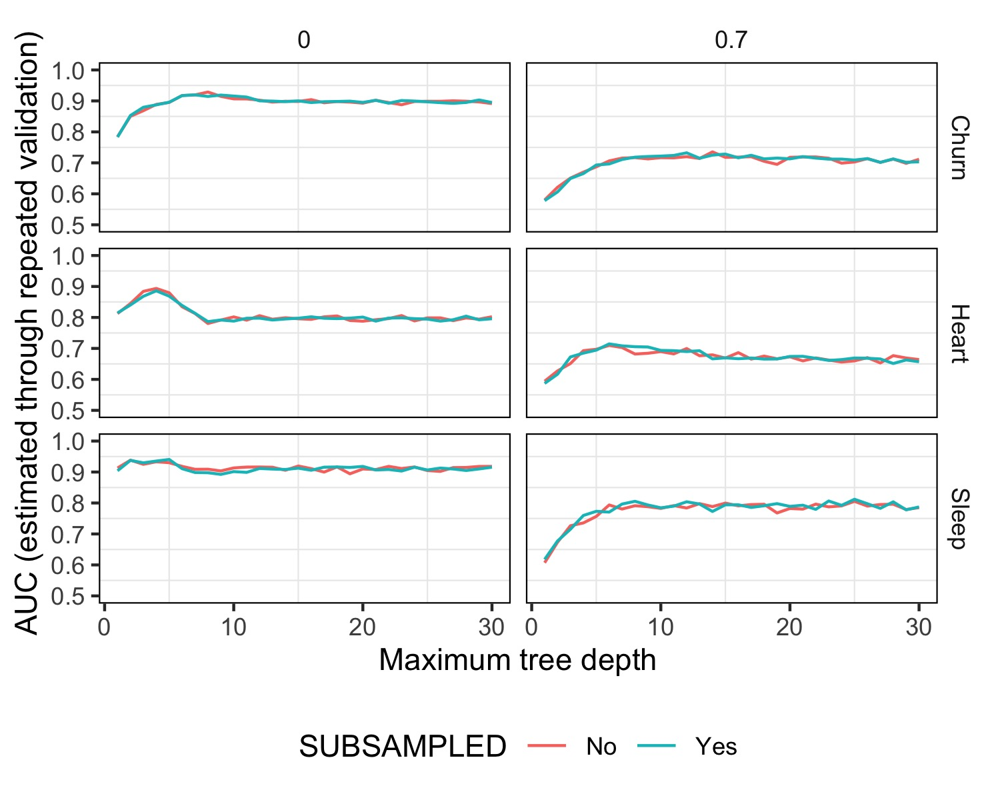

# Experimento propio

### Subsampling de clase mayoritaria

```{r message=FALSE, warning=FALSE}
library(dplyr)
```

Decidimos hacer subsampling como nuestro experimento propio para estudiar si el balanceo/desbalanceo de clases en la variable a predecir tiene efecto en la performance del modelo. Para eso, eliminamos al azar algunas observaciones de la clase mayoritaria para lograr igual cantidad de observaciones en ambas clases. Luego entrenamos nuestro modelo y estimamos la performance. Se comparan los resultados de cada dataset. Adicionalmente decidimos agregar otra variable independiente al experimento que supusimos útil: proporción de datos faltantes.\
Nuestra hipótesis inicial era que el modelo debería predecir mejor en datasets balanceados que en los que no lo están ya que podría haber un sesgo de predecir en mayor proporción a clase mayoritaria. En datasets con datos faltantes, este fenómeno se debería pronunciar más ya que las posibilidades de poca representación son mayores.

```{r message=FALSE, warning=FALSE}
data_heart = read.table("./data/heart.csv",header=TRUE, sep = ",")

data_churn = read.table("./data/customer_churn.csv", header=TRUE,sep = ",")

data_sleep = read.table("./data/sleep_health_proc.csv",header=TRUE, sep = ",")
```

```{r message=FALSE, warning=FALSE}
par(mfrow=c(1, 3))
barplot(prop.table(table(data_churn$churn)), main = "Churn" , col = blues9, ylim = (c(0,1)))
barplot(prop.table(table(data_heart$HeartDisease)), main = "Heart Disease", col = blues9, ylim = (c(0,1)))
barplot(prop.table(table(data_sleep$Sleep.Disorder)), main = "Sleep Disorder", col = blues9, ylim = (c(0,1)))
par(mfrow=c(1, 1))
```

Tanto el dataset de Sleep Dissorder como el de Heart Disease están realtivamente balanceados, a diferencia del dataset de Churn que la clase *non-churn* es mayoritaria. Creemos que balancear en los 2 datasets más balanceados no tendrá mucho efecto, pero que la perfomance sobre Churn mejorará.



Luego de hacer el experimento, notamos que no hay tales mejoras en la performance en ninguno de los 3 datasets incluso con datos faltantes. Esperábamos que esto ocurra tanto para Heart como para Sleep, ya que las clases estaban caqsi balanceadas, pero no para Churn. Pensamos que puede ocurrir que cada clase está lo suficimientemente representada o la distinción entre ambas clases es simple de captar para el modelo.[^1]

[^1]: El experimento que se encuentra en exp_propio.R no corresponde exactamente al reportado aquí, sino que fue modificado para obtener los resultados posteriores.

Notamos que los modelos que subsamplean tienen menor cantidad de observaciones al entrenarse y que mantienen la performance. Por lo tanto, vamos a recrear el experiemento en donde los no subsampleados pasen a hacer un subsampleo random (de los datos datos reales, agarro 2n observaciones al azar, donde n es la cantidad de datos en la clase minoritaria) para poder comparar 2 modelos entrenados con la misma cantidad de datos.

```{r message=FALSE, warning=FALSE}
source("exp_propio.R")
```

Luego de hacer el experimento con ambos modelos entrenados con la misma cantidad de observaciones, no notamos ninguna mejora en la performance del mismo. Es de interés observar que con menor cantidad de datos de entrenamiento se obtiene una performance similar.

***Aclaración:*** en la implementanción, realizamos el subsampling previo a dividir las observaciones en entrenamiento y validación. Si bien esto no genera data leakage (a diferencia de oversamplear antes de dividir los datos), se podría dividir las observaciones y luego sólo subsamplear el set de entrenamiento, para tener un set de validación más grande y representativo.
